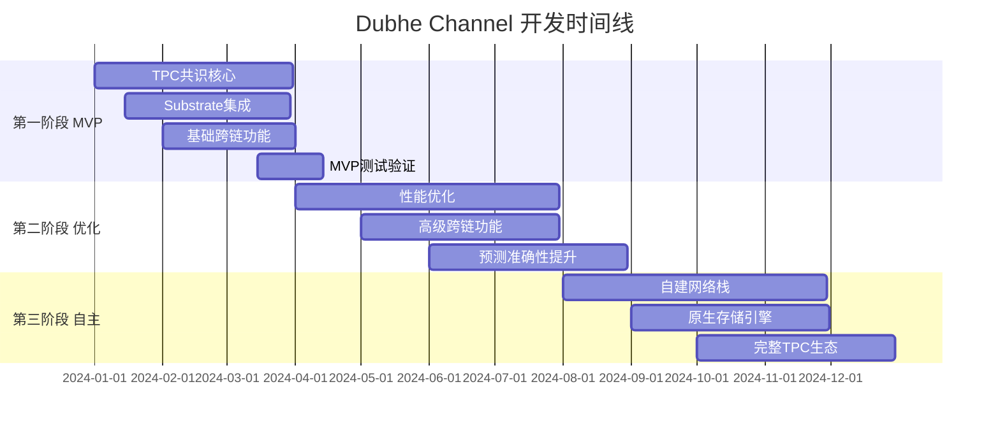

# Dubhe Channel 混合架构技术方案

## 🏗️ 总体架构决策：自建核心 + 集成成熟组件

### 核心原则

- **TPC 共识**：100%自研，这是你的核心竞争优势
- **基础设施**：借鉴成熟 SDK，加速开发
- **互操作性**：兼容 Cosmos IBC + Polkadot XCM
- **渐进式迁移**：先 MVP，后完整自建

---

## 📋 技术栈选择对比

### 自建 vs SDK 决策矩阵

| 组件             | 自建 | Substrate | Cosmos SDK | 理由                      |
| ---------------- | ---- | --------- | ---------- | ------------------------- |
| **TPC 共识引擎** | ✅   | ❌        | ❌         | 原创算法，无法外包        |
| **预测执行引擎** | ✅   | ❌        | ❌         | 核心竞争优势              |
| **自适应调度器** | ✅   | ❌        | ❌         | 多链策略融合              |
| **P2P 网络层**   | 🔄   | ✅        | ✅         | 成熟的 libp2p 可复用      |
| **状态存储**     | 🔄   | ✅        | ✅         | RocksDB 抽象层已成熟      |
| **免分叉升级**   | 🔄   | ✅        | ❌         | Substrate Wasm 运行时优秀 |
| **跨链通信**     | 🔄   | ✅        | ✅         | IBC/XCM 标准成熟          |
| **RPC 接口**     | 🔄   | ✅        | ✅         | JSON-RPC 标准化           |

**符号说明**：

- ✅ 推荐该方案
- ❌ 不适用/不推荐
- 🔄 可借鉴/混合使用

---

## 🎯 推荐方案：**分层混合架构**

### 第一阶段：MVP 快速验证（3-6 个月）

```rust
// 核心架构概览
dubhe-channel/
├── consensus/           # 100%自建 - TPC共识
│   ├── tpc_engine.rs
│   ├── prediction.rs
│   └── temporal_locking.rs
├── execution/           # 100%自建 - 预测执行
│   ├── predictive_vm.rs
│   └── pre_execution.rs
├── substrate_runtime/   # 🔄借鉴 - 基础设施
│   ├── pallets/
│   └── runtime.rs
└── cosmos_ibc/         # 🔄集成 - 跨链通信
    └── ibc_handler.rs
```

#### 技术实现策略：

**1. TPC 共识层（自建）**

```rust
// crates/consensus/src/tpc_hybrid.rs
pub struct HybridTpcConsensus {
    // 自建TPC核心
    tpc_engine: TpcEngine,
    prediction_pool: PredictionPool,

    // 借鉴Substrate的GRANDPA终局性
    grandpa_finality: GrandpaFinalityBridge,

    // 集成Cosmos的快速共识
    tendermint_bridge: TendermintBridge,
}

impl HybridTpcConsensus {
    pub async fn hybrid_consensus_round(&mut self) -> Result<Block> {
        // 1. TPC预测阶段（自建）
        let predictions = self.tpc_engine.generate_predictions().await?;

        // 2. 借鉴Tendermint的拜占庭容错投票
        let votes = self.tendermint_bridge.collect_votes(predictions).await?;

        // 3. TPC时间锁定（自建）
        let temporal_block = self.tpc_engine.temporal_lock(votes).await?;

        // 4. 借鉴GRANDPA的批量终局性
        self.grandpa_finality.finalize_batch(temporal_block).await
    }
}
```

**2. 基础设施层（借鉴 Substrate）**

```rust
// runtime/src/lib.rs - 借鉴Substrate模块化
construct_runtime!(
    pub enum Runtime where
        Block = Block,
        NodeBlock = opaque::Block,
        UncheckedExtrinsic = UncheckedExtrinsic
    {
        // Substrate标准模块
        System: frame_system,
        Timestamp: pallet_timestamp,
        Balances: pallet_balances,

        // 自建TPC模块
        TpcConsensus: pallet_tpc_consensus,
        PredictiveExecution: pallet_predictive_execution,
        AdaptiveScheduler: pallet_adaptive_scheduler,
    }
);
```

**3. 跨链通信（集成 Cosmos IBC）**

```rust
// crates/interop/src/hybrid_ibc.rs
pub struct DubheIbcHandler {
    // 原生IBC支持
    cosmos_ibc: CosmosIbcClient,

    // TPC增强的跨链预测
    tpc_bridge: TpcCrosschainBridge,
}

impl DubheIbcHandler {
    pub async fn predictive_cross_chain_tx(&self, tx: CrossChainTx) -> Result<()> {
        // 1. 使用TPC预测目标链状态
        let predicted_state = self.tpc_bridge.predict_target_chain(tx.target_chain).await?;

        // 2. 标准IBC通信
        let ibc_packet = self.cosmos_ibc.create_packet(tx, predicted_state).await?;

        // 3. TPC时间锁定确保原子性
        self.tpc_bridge.temporal_lock_cross_chain(ibc_packet).await
    }
}
```

---

## 🚀 第二阶段：性能优化（6-12 个月）

### 高性能混合方案

**1. 网络层优化**

```rust
// 借鉴libp2p + 自建TPC协议
pub struct DubheNetwork {
    libp2p_swarm: Swarm<DubheBehaviour>,
    tpc_protocol: TpcNetworkProtocol,  // 自建
    substrate_gossip: GossipEngine,    // 借鉴
}
```

**2. 存储层优化**

```rust
// 借鉴ParityDB + 自建预测缓存
pub struct DubheStorage {
    parity_db: Arc<ParityDb>,              // 借鉴
    prediction_cache: TpcPredictionCache,  // 自建
    zero_copy_sync: ZeroCopyStateSync,     // 自建
}
```

**3. 虚拟机集成**

```rust
// 多VM支持策略
pub enum VmExecutionStrategy {
    // 借鉴现有VM
    SubstrateWasm(WasmExecutor),
    CosmosCosmWasm(CosmWasmVm),

    // 自建预测执行VM
    TpcPredictiveVm(PredictiveVmInstance),
}
```

---

## 🔄 第三阶段：完全自主（12-24 个月）

### 逐步脱离依赖策略

**阶段 3.1：自建网络栈**

```rust
// 完全自建P2P协议
pub struct DubheNativeNetwork {
    tpc_gossip: TpcGossipProtocol,
    prediction_sync: PredictionSyncProtocol,
    temporal_consensus: TemporalConsensusProtocol,
}
```

**阶段 3.2：自建存储引擎**

```rust
// TPC优化的存储引擎
pub struct TpcNativeStorage {
    temporal_db: TemporalDatabase,
    prediction_index: PredictionIndexEngine,
    zero_latency_cache: ZeroLatencyCache,
}
```

**阶段 3.3：原生跨链协议**

```rust
// TPC原生跨链协议
pub struct TpcNativeCrossChain {
    temporal_bridge: TemporalBridge,
    predictive_routing: PredictiveRouting,
    consensus_synchronization: ConsensusSynchronization,
}
```

---

## 💡 关键技术集成点

### 1. **Substrate 集成优势**

```toml
# Cargo.toml依赖策略
[dependencies]
# Substrate基础设施（借鉴）
substrate-client-api = "4.0"
substrate-service = "4.0"
substrate-frame = "4.0"

# TPC自建组件
dubhe-tpc-consensus = { path = "./crates/consensus" }
dubhe-predictive-execution = { path = "./crates/execution" }
```

**集成策略**：

- ✅ 使用 Substrate 的客户端架构
- ✅ 借鉴 FRAME 模块化设计
- ✅ 利用 Substrate 的 Wasm 运行时
- ❌ 不使用 BABE/GRANDPA（用 TPC 替代）

### 2. **Cosmos 集成优势**

```rust
// IBC集成示例
use cosmos_ibc::*;

impl TpcCosmosIntegration {
    pub async fn tpc_ibc_transfer(&self, msg: MsgTransfer) -> Result<()> {
        // 1. TPC预测目标链状态
        let prediction = self.tpc_predict_cosmos_chain(msg.target_chain).await?;

        // 2. 标准IBC传输
        let result = self.ibc_transfer(msg).await?;

        // 3. TPC验证预测准确性
        self.tpc_validate_prediction(prediction, result).await
    }
}
```

**集成策略**：

- ✅ 兼容 IBC 标准协议
- ✅ 使用 Cosmos SDK 模块
- ✅ 支持 Tendermint 桥接
- ❌ 不使用 Cosmos 原生共识（用 TPC 增强）

---

## 📊 开发资源分配建议

### 团队配置（6-8 人核心团队）

| 角色                     | 人数 | 主要职责                 | 技能要求               |
| ------------------------ | ---- | ------------------------ | ---------------------- |
| **TPC 架构师**           | 1    | TPC 共识设计、预测算法   | Rust+密码学+共识算法   |
| **Substrate 集成工程师** | 2    | 基础设施集成、运行时开发 | Rust+Substrate+FRAME   |
| **Cosmos 集成工程师**    | 1    | IBC 集成、跨链桥接       | Go+Cosmos SDK+IBC      |
| **性能优化工程师**       | 1    | 存储、网络、VM 优化      | Rust+系统编程+性能调优 |
| **全栈工程师**           | 2    | API 开发、工具链、测试   | Rust+TypeScript+DevOps |
| **DevOps 工程师**        | 1    | CI/CD、部署、监控        | Docker+K8s+监控工具    |

### 开发时间线（18 个月总计）



---

## 🎯 实施建议

### 立即开始（第一周）

1. **搭建混合架构脚手架**
2. **确定 Substrate vs Cosmos 集成策略**
3. **实现 TPC 共识 MVP**

### 验证节点（第一个月）

1. **TPC + Substrate Runtime 集成测试**
2. **基础 IBC 跨链功能验证**
3. **性能基准测试**

### 风险控制

- **技术风险**：TPC 共识复杂性 → 分阶段验证
- **集成风险**：SDK 版本兼容性 → 固定依赖版本
- **性能风险**：混合架构开销 → 持续性能监控

这个混合策略让你既能快速 MVP 验证 TPC 创新，又能逐步构建完全自主的区块链基础设施。你觉得这个方案如何？
